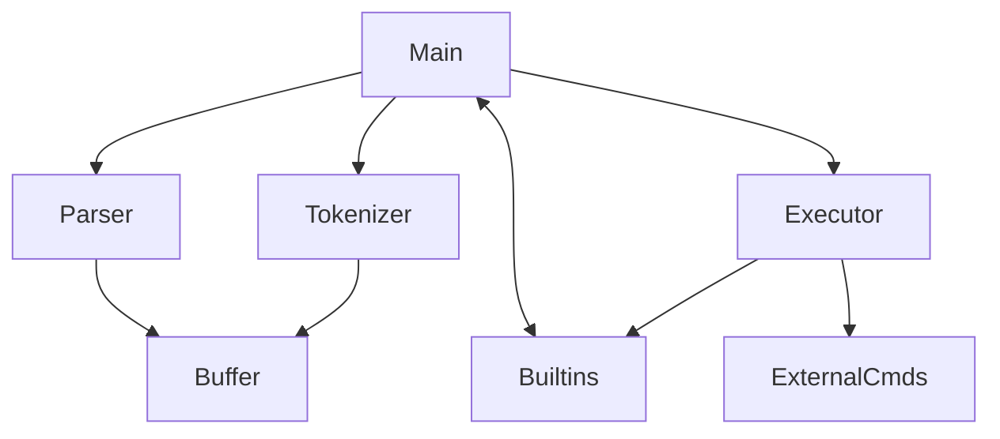

```mermaid
graph TD
  Main --> Tokenizer
  Main --> Parser
  Main --> Executor
  Tokenizer --> Buffer
  Parser --> Buffer
  Executor --> Builtins
  Executor --> ExternalCmds

  %% Two-way "knows about" relationship
  Main <---> Builtins
```
