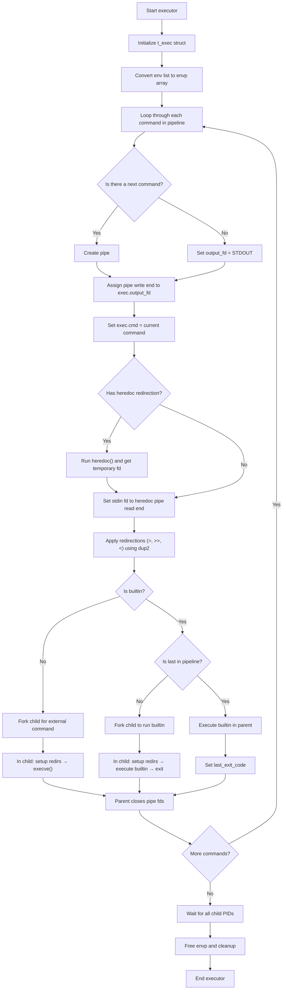

- Handle builtins (`cd`, `export`, etc.).
- Fork + execve for external programs.
- Set up pipes and redirections.builtins

```mermaid    
flowchart TD

A[Start executor] --> B[Initialize t_exec struct]
B --> C[Convert env list to envp array]
C --> D[Loop through each command in pipeline]

D --> E{Is there a next command?}
E -->|Yes| F[Create pipe]
E -->|No| G["Set output_fd = STDOUT"]

F --> H[Assign pipe write end to exec.output_fd]
G --> H

H --> I["Set exec.cmd = current command"]

I --> J{Has heredoc redirection?}
J -->|Yes| K["Run heredoc() and get temporary fd"]
K --> L[Set stdin fd to heredoc pipe read end]
J -->|No| L

L --> M["Apply redirections (>, >>, <) using dup2"]
M --> N{Is builtin?}

N -->|Yes| O{Is last in pipeline?}
O -->|Yes| P[Execute builtin in parent]
O -->|No| Q[Fork child to run builtin]
Q --> R[In child: setup redirs → execute builtin → exit]
P --> S[Set last_exit_code]

N -->|No| T[Fork child for external command]
T --> U["In child: setup redirs → execve()"]
U --> V[Parent closes pipe fds]

R --> V
S --> V
V --> W{More commands?}
W -->|Yes| D
W -->|No| X[Wait for all child PIDs]

X --> Y[Free envp and cleanup]
Y --> Z[End executor]

```
